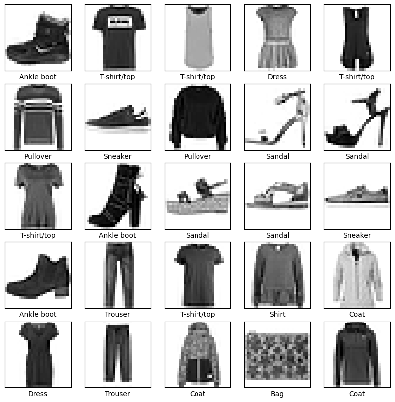
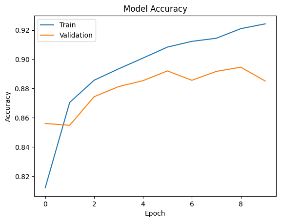
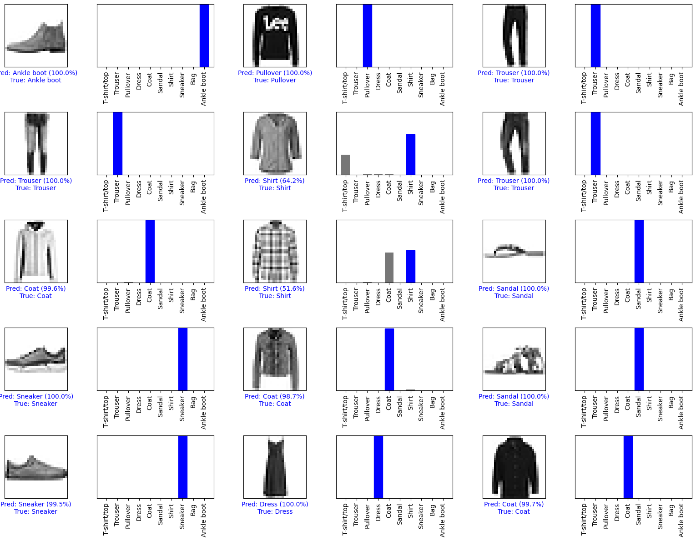
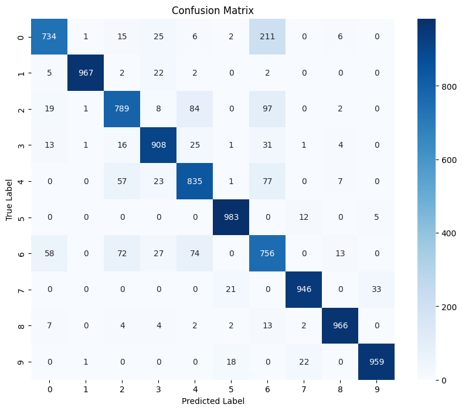

# CNN Image Classification (Fashion-MNIST)


Deep learning **Convolutional Neural Network (CNN)** model for classifying clothing images from the **Fashion-MNIST dataset** using **TensorFlow/Keras**.

---

# 🚀 Project Overview

Image classification is a core problem in **computer vision**.
This project builds a **CNN-based deep learning model** that learns visual patterns from grayscale clothing images and predicts the correct clothing category.

The model processes images through **convolutional layers** to extract spatial features and classify them into **10 fashion categories**.

Key objectives of the project:

* Build a **Convolutional Neural Network (CNN)** for image classification
* Train the model on the **Fashion-MNIST dataset**
* Visualize dataset samples and predictions
* Evaluate model performance using **accuracy and confusion matrix**
* Analyze prediction confidence using **probability distributions**

---

# 🧠 Model Architecture

The CNN model architecture used in this project:

```
Input Layer (28×28 grayscale image)

Conv2D (32 filters, 3×3)
MaxPooling2D

Conv2D (64 filters, 3×3)
MaxPooling2D

Conv2D (64 filters, 3×3)

Flatten

Dense (128 neurons, ReLU)

Dense (10 neurons, Softmax)
```

The convolutional layers extract **visual features**, while the dense layers perform **classification**.

---

# 📁 Dataset

Dataset used: **Fashion-MNIST**

Fashion-MNIST is a dataset of clothing images designed as a replacement for the classic MNIST dataset.

Dataset characteristics:

* Training images: **60,000**
* Test images: **10,000**
* Image size: **28 × 28 pixels**
* Color format: **Grayscale**
* Total classes: **10**

Classes:

```
T-shirt/top
Trouser
Pullover
Dress
Coat
Sandal
Shirt
Sneaker
Bag
Ankle boot
```

---

# 📊 Dataset Visualization

Example samples from the dataset.



---

# 📈 Training Results

Model training performance:

* Training Accuracy: **~93%**
* Validation Accuracy: **~88–89%**
* Test Accuracy: **~90–92%**

The CNN successfully learns visual features from the dataset and achieves strong classification performance.

---

# 📉 Accuracy Graph

Training vs validation accuracy across epochs.



---

# 🔍 Model Predictions

Example predictions with **confidence scores and probability distributions**.



Each prediction shows:

* Predicted class
* True class
* Prediction confidence
* Probability distribution across all classes

---

# 📊 Confusion Matrix

Confusion matrix showing model performance across all classes.



Observations:

* Strong performance on classes like **Trouser, Sandal, Sneaker, Bag**
* Some confusion between visually similar categories such as **Shirt, Pullover, and Coat**

---

# ⚙️ Technologies Used

* Python
* TensorFlow / Keras
* NumPy
* Matplotlib
* Seaborn
* Scikit-learn

---

# ▶️ How to Run

### 1️⃣ Clone the repository

```
git clone https://github.com/Rozario00/cnn-image-classification-fashion-mnist.git```

### 2️⃣ Install dependencies

```
pip install -r requirements.txt
```

### 3️⃣ Run the notebook

Open and run:

```
cnn_image_classification.ipynb
```

---

# 📂 Project Structure

```
cnn-image-classification-fashion-mnist
│
├── cnn_image_classification.ipynb
├── dataset_samples.png
├── accuracy_graph.png
├── cnn_predictions.png
├── confusion_matrix.png
├── requirements.txt
└── README.md
```

---

# 🔮 Future Improvements

Possible enhancements for this project:

* Train deeper CNN architectures
* Apply **data augmentation**
* Experiment with **transfer learning models**
* Deploy the model as a **web application**
* Build a **real-time image classification system**

---

# 👤 Author

**Dheeraj C**

AI & Machine Learning Enthusiast
Interested in building real-world AI systems using machine learning, deep learning, and data science.

---

⭐ If you found this project useful, consider giving it a **star**.
